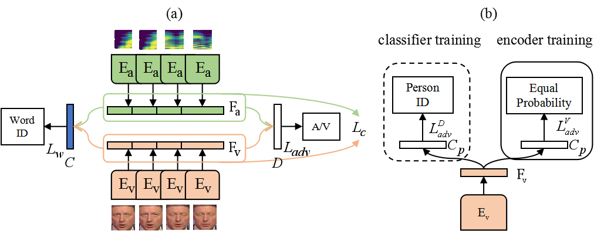
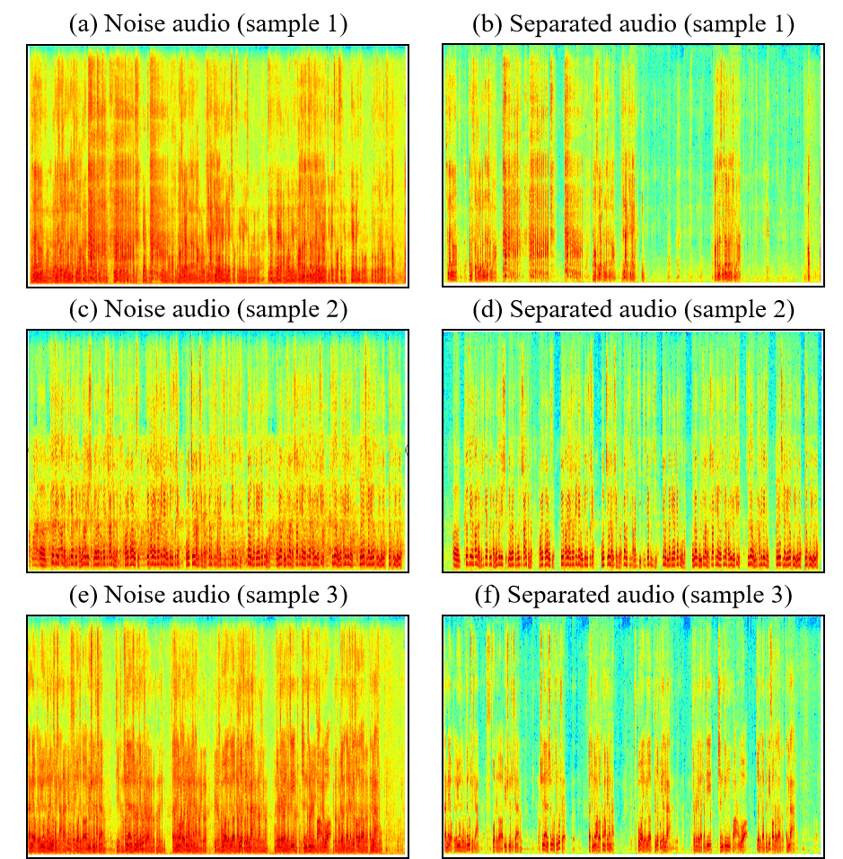

# Audio-Visual Speech Separation with Visual Features Enhanced by Adversarial Training

## Overview
Demo samples of our paper *"Audio-Visual Speech Separation with Visual Features Enhanced by Adversarial Training"*. 

If you have any question about implementation details, feel free to ask me (1002434886@qq.com).

## Abstract
Audio-visual speech separation (AVSS) refers to separating individual voice from an audio mixture of multiple simultaneous talkers by conditioning on visual features. For the
AVSS task, visual features play an important role, based on which we manage to extract more effective visual features to improve the performance**. In this paper, we propose a novel AVSS model that uses speech-related visual features for isolating the target speaker. Specifically, the method of extracting speech-related visual features has two steps. Firstly, we extract the visual features that contain speech-related information by learning joint audio-visual representation. Secondly, we use the adversarial training method
to enhance speech-related information in visual features further. We adopt the time-domain approach and build audio-visual speech separation networks with temporal convolutional neural network block. Experiments on audio-visual datasets, including GRID, TCD-TIMIT, AVSpeech, and LRS2, show that our model significantly outperforms previous state-of-the-art AVSS models. We also demonstrate that our model can achieve excellent speech separation performance in noisy real-world scenarios. Moreover, in order to alleviate the performance degradation of AVSS models caused by the missing of some video frames, we propose a training strategy, which makes our model robust when video frames are partially missing. 

<div align=center></div>

## Model
### Extract speech-related visual features
The details of networks architecture can be found at [*./code/visual_front*](./code/visual_front). **Please note the code annotation**
<div align=center></div>

### Audio-visual speech separation networks
The networks can be easily built based on our paper.
<div align=center></div>

## Datasets
* GRID [[paper]](http://www.laslab.org/wp-content/uploads/an_audio-visual_corpus_for_speech_perception_and_automatic_speech_recognition.pdf) [[dataset page]](http://spandh.dcs.shef.ac.uk/gridcorpus/)
* TCD-TIMIT [[paper]](https://ieeexplore.ieee.org/abstract/document/7050271) [[dataset page]](https://sigmedia.tcd.ie/TCDTIMIT/)
* AVSpeech [[paper]](https://arxiv.org/pdf/1804.03619.pdf) [[dataset page]](https://looking-to-listen.github.io/avspeech/index.html)
* LRS2 [[paper]](https://www.robots.ox.ac.uk/~vgg/publications/2019/Afouras19/afouras18c.pdf) [[dataset page]](http://www.robots.ox.ac.uk/~vgg/data/lip_reading/lrs2.html)

The method of generating training, validation, and test samples is detailed in our paper.

## Result
### Video and Audio Samples
We provide many samples from standard datasets and recorded in a real world environment. 
- Listen and watch the samples that recorded in real world environment at [*./samples/samples of real-world environment*](./samples/samples%20of%20real-world%20environment).
- Listen the samples from standard datasets at [*./samples/sample of standard dataset*](https://github.com/aispeech-lab/advr-avss/tree/master/samples/samples%20of%20standard%20dataset)
- Spectrogram samples that recorded in real world environment.
<div align=center></div>

## Citations

If you find this repo helpful, please consider citing:

```
@inproceedings{zhang2021avss,
  title={Audio-Visual Speech Separation with Visual Features Enhanced by Adversarial Training},
  author={Zhang, Peng and Xu, Jiaming and Shi, Jing and Hao, Yunzhe and Qin, Lei and Xu, Bo},
  booktitle={In Proceedings of the 33th International Joint Conference on Neural Network (IJCNN)},
  year={2021},
  organization={IEEE}
}
```
